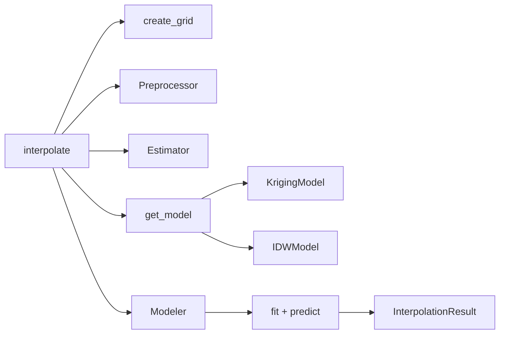

# Models

py3dinterpolations supports two interpolation methods:

| Model | `model_type` | Description |
|-------|-------------|-------------|
| Ordinary Kriging | `"ordinary_kriging"` | Geostatistical method using spatial autocorrelation via variograms |
| Inverse Distance Weighting | `"idw"` | Deterministic method using inverse-distance weighted averages |

## Ordinary Kriging

Kriging uses a variogram to model spatial autocorrelation and produces both
predictions and variance estimates. It is backed by
[PyKrige](https://github.com/GeoStat-Framework/PyKrige).

```python
from py3dinterpolations import GridData, interpolate

modeler = interpolate(
    griddata=griddata,
    model_type="ordinary_kriging",
    grid_resolution=5.0,
    model_params={
        "variogram_model": "spherical",
        "nlags": 15,
        "weight": True,
    },
)

# kriging also returns variance
result = modeler.result
print(result.interpolated.shape)  # 3D array of predictions
print(result.variance.shape)      # 3D array of kriging variance
```

### Variogram parameters

The `model_params` dict is passed directly to PyKrige's `OrdinaryKriging3D`.
Key parameters:

| Parameter | Description |
|-----------|-------------|
| `variogram_model` | `"linear"`, `"power"`, `"gaussian"`, `"spherical"`, `"exponential"` |
| `nlags` | Number of lags for variogram estimation |
| `weight` | Whether to use weighted least squares for variogram fitting |
| `exact_values` | If `True`, predictions at data points match exact values |

### Cross-validation with `model_params_grid`

Instead of specifying fixed parameters, pass a parameter grid to search over
using scikit-learn's `GridSearchCV`:

```python
modeler = interpolate(
    griddata=griddata,
    model_type="ordinary_kriging",
    grid_resolution=5.0,
    model_params_grid={
        "method": ["ordinary3d"],
        "variogram_model": ["linear", "spherical", "gaussian"],
        "nlags": [6, 10, 15],
        "weight": [True, False],
    },
)
```

!!! note
    Cross-validation is only supported for `ordinary_kriging`. The `"method"` key
    must be `["ordinary3d"]` — this is required by PyKrige's sklearn interface.

## Inverse Distance Weighting (IDW)

IDW is a deterministic method where unknown values are computed as a weighted
average of known values. Weights are inversely proportional to distance raised
to a power.

$$
u(\mathbf{x}) = \frac{\sum_{i=1}^{N} w_i(\mathbf{x}) \, u_i}{\sum_{i=1}^{N} w_i(\mathbf{x})}
\quad \text{where} \quad
w_i(\mathbf{x}) = \frac{1}{d(\mathbf{x}, \mathbf{x}_i)^p}
$$

```python
modeler = interpolate(
    griddata=griddata,
    model_type="idw",
    grid_resolution=5.0,
    model_params={"power": 2},
)
```

### Parameters

| Parameter | Default | Description |
|-----------|---------|-------------|
| `power` | `2` | Exponent for inverse distance. Higher values give more weight to nearby points. |

IDW does not return variance estimates (`result.variance` is `None`).

## Choosing a model

| Consideration | Kriging | IDW |
|--------------|---------|-----|
| Accuracy | Generally better for spatially correlated data | Simpler, no assumptions |
| Speed | Slower (variogram fitting) | Fast |
| Uncertainty | Provides variance estimates | No variance |
| Parameters | Variogram model, nlags, weight | Power only |
| Best for | Geostatistical data with clear spatial patterns | Quick estimates, dense data |

## Architecture


