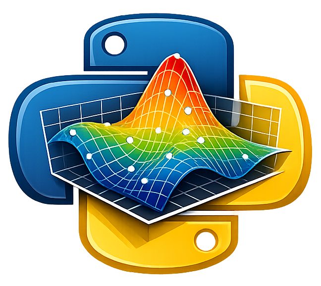

---
hide:
  - navigation
---

<div align="center" markdown>

{ width="120" }

# py3dinterpolations

**Quick 3D interpolation with Python.**

[](https://pypi.org/project/py3dinterpolations/)
[](https://pypi.org/project/py3dinterpolations/)
[](https://github.com/giocaizzi/py3dinterpolations/actions/workflows/tests.yml)
[](https://codecov.io/gh/giocaizzi/py3dinterpolations)
[](https://opensource.org/licenses/MIT)

</div>

---

Interpolate scattered 3D spatial data onto regular grids using **Ordinary Kriging** or **Inverse Distance Weighting (IDW)**. Built on top of [PyKrige](https://github.com/GeoStat-Framework/PyKrige) and [scikit-learn](https://scikit-learn.org/), with built-in preprocessing, cross-validation, and interactive visualizations.

```python
import pandas as pd
from py3dinterpolations import GridData, interpolate

# load your spatial data (columns: ID, X, Y, Z, V)
df = pd.read_csv("measurements.csv")
griddata = GridData(df)

# interpolate onto a regular 3D grid
modeler = interpolate(
    griddata=griddata,
    model_type="ordinary_kriging",
    grid_resolution=5.0,
    model_params={"variogram_model": "linear", "nlags": 6, "weight": True},
)

# access results
result = modeler.result  # InterpolationResult with .interpolated array
```

## Features

- **Interpolation** — Ordinary 3D Kriging and IDW out of the box
- **Preprocessing** — downsampling, coordinate normalization, signal standardization
- **Cross-validation** — parameter grid search for kriging models
- **Visualization** — 2D slices with [matplotlib](https://matplotlib.org/), interactive 3D with [plotly](https://plotly.com/)

## Quick links

- [Installation](getting-started/installation.md)
- [Quick Start](getting-started/quickstart.md)
- [API Reference](reference/index.md)
